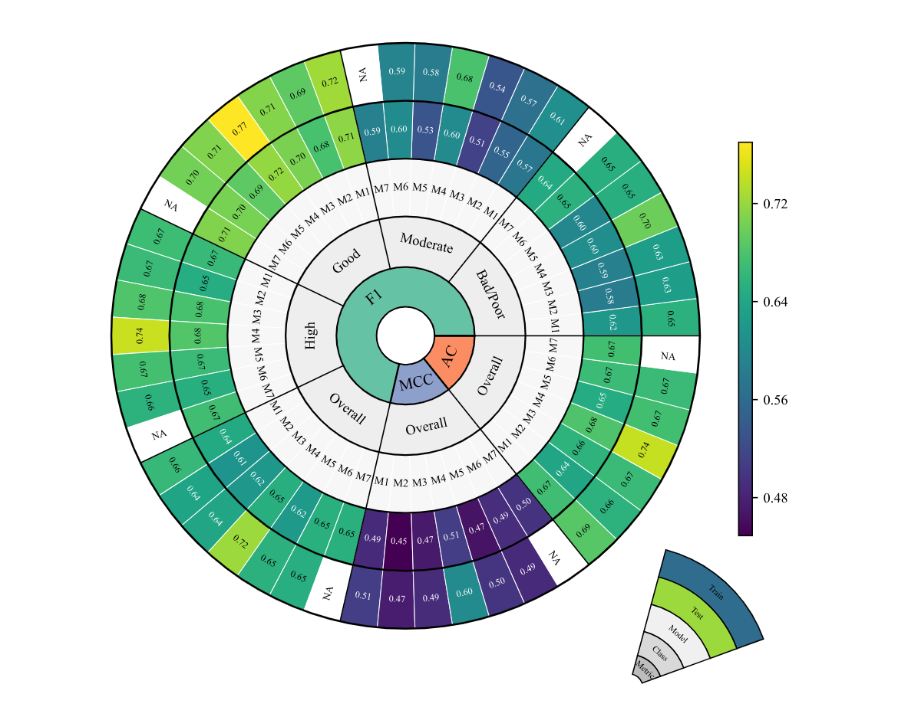
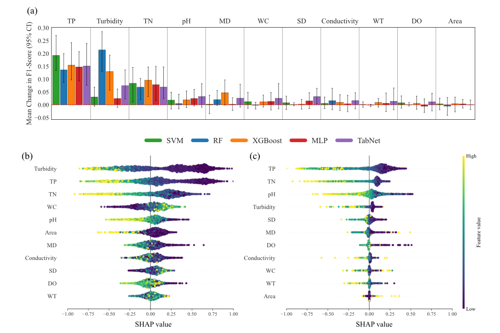

# 🇫🇮 National-Scale Machine Learning Assessment of Lake Ecological Status under the EU WFD

---

**Author:** Mehran Mahdian  
**Contact:** Mehran.mahdian@uef.fi  
**Organization:** University of Eastern Finland  
**Website:**  
- [LinkedIn](https://www.linkedin.com/in/mehran-mahdian1993/)  
- [Google Scholar](https://scholar.google.com/citations?user=GWxu7rQAAAAJ&hl=en&oi=ao)

---

# 🌍 Project Overview

## 📌 Problem Statement

Lakes provide critical ecosystem services including biodiversity support, drinking water, fisheries, and recreation. However, anthropogenic pressures and climate change are accelerating:

- Eutrophication  
- Browning  
- Oxygen depletion  

Under the **EU Water Framework Directive (WFD)**, ecological status is assessed using biological quality elements. These assessments are:

- Expensive  
- Labor intensive  
- Temporally sparse  
- Not near–real-time  

There is currently **no national-scale framework** that predicts WFD ecological status using only routinely measured physicochemical variables.

---

## ⚠️ Challenge Statement

WFD ecological classification is difficult to model because:

- Ecological classes overlap (especially the *Moderate* class)  
- Class imbalance exists (few Bad/Poor lakes)  
- Relationships are nonlinear and multivariate  
- Ecological boundaries are transitional and noisy  

---

## 💡 Solution Statement

This study develops a **national-scale machine learning framework** that:

- Uses only routine water-quality and morphometric variables  
- Compares **RF, XGBoost, SVM, ANN, and TabNet**  
- Implements a **Bayesian Neural Network (BNN)**  
- Decomposes uncertainty into **aleatoric and epistemic components**  
- Applies **SHAP and permutation importance** for interpretability  
- Evaluates probabilistic calibration (ECE & Brier score)

---

## 🎯 Objectives

- Classify WFD ecological status from routine variables  
- Identify dominant environmental drivers  
- Quantify predictive uncertainty  
- Provide a scalable complement to biological WFD monitoring  

---

## 📚 Literature Review (Foundational Methods)

This workflow builds upon foundational machine learning and explainability methods:

- Breiman (2001) – Random Forest  
- Cortes & Vapnik (1995) – Support Vector Machine  
- Chen & Guestrin (2016) – XGBoost  
- Arik & Pfister (2021) – TabNet  
- Lundberg & Lee (2017) – SHAP  
- Bayesian Neural Networks with Variational Inference  

---

## 🔎 Research Questions

**RQ1:**  
Can routine water-quality variables predict WFD ecological status at national scale?

**RQ2:**  
Which environmental variables most strongly influence classification?

**RQ3:**  
Does Bayesian modeling improve probability calibration?

**RQ4:**  
Is predictive uncertainty primarily aleatoric or epistemic?

---

# 📊 Data Sources

## Study Area

- Country: **Finland**  
- Lakes: **2,487**  
- Monitoring Period: **2012–2017**  
- Surface samples: **0–2 m depth**  
- Aggregation: Lake-wise period means  

Training and testing use **5-fold cross-validation** within the same monitoring period.

---

## Published Data Sources

| Name    | Source | Description | Access | URL |
|---------|--------|------------|--------|-----|
| Hertta Database | SYKE | Water quality & WFD ecological status | Open access | https://www.syke.fi/en/environmental-data/open-web-services/environmental-data-apis#directory |

---

## Data Access Notes

Data are publicly available through SYKE open web services.

Users must download raw datasets and place them in the `inputs/` directory before running the workflow.

---

# ⚙️ Methods Summary

## 🧠 Model Framework

Supervised Machine Learning and Deep Learning classification framework.

---

## 🔄 Preprocessing Steps

- Surface filtering (0–2 m)
- Lake-wise aggregation (2012–2017 mean)
- kNN imputation (<6% missing data)
- MWMOTE oversampling (training folds only)
- 5-fold cross-validation
- Hyperparameter optimization using **Optuna**

---

## 🤖 Models

- Random Forest  
- XGBoost  
- SVM  
- ANN (MLP)  
- TabNet  
- Bayesian Neural Network (Variational Inference)

---

## 🔍 Interpretability

- Permutation importance  
- SHAP analysis  
- Kruskal–Wallis statistical testing  

---

## 📈 Evaluation Metrics

- F1-score (primary metric)  
- Accuracy  
- MCC  
- Brier score  
- Expected Calibration Error (ECE)

---

# 📁 Repository Structure

# 📁 Repository Structure

| Folder/File | Description |
|-------------|-------------|
| `README.md` | Project overview and documentation |
| `LICENSE` | Project license (MIT) |
| `.gitignore` | Specifies files ignored by Git |
| `figures/` | Figures used in the manuscript and README |
| `xgboost/` | Core Python scripts for preprocessing and modeling and XGBoost modeling scripts and related outputs |

---

# 🔁 How to Reproduce

## 💻 Computational Requirements

- Python 3.10+  
- 16 GB RAM recommended  
- Optional GPU for BNN  
- OS: Windows / Linux / macOS  

---

## 🔹 Model Performance

The machine learning framework achieved robust national-scale classification performance:

- Best multi-class macro-F1 ≈ **0.65**
- Binary classification F1 ≈ **0.84**
- Best calibration achieved by **Bayesian Neural Network (ECE = 0.016)**
- Nutrient variables (TP, TN, turbidity) dominate predictive performance
- Moderate class is the most difficult to classify
- Predictive uncertainty is primarily **aleatoric**

---

## 🔹 Multi-Class Classification Performance

*Figure 1. Model performance metrics based on F1-score, accuracy, and Matthews correlation coefficient (MCC). Note that M1, M2, M3, M4, M5, M6, and M7 represent the Bayesian Neural Network, Support Vector Machine, Random Forest, XGBoost, Artificial Neural Network, TabNet, and Ensemble approach, respectively.*

---

## 🔹 Feature Importance (SHAP Analysis)

*Figure 2. Feature importance analysis showing dominant environmental drivers of ecological status classification. Panel (a) presents the Permutation Importance results. Panels (b) and (c) display SHAP summary plots derived from the XGBoost and TabNet models, respectively. Abbreviations: TP (Total Phosphorus), TN (Total Nitrogen), MD (Maximum Depth), WC (Water Color), SD (Secchi Depth), WT (Water Temperature), and DO (Dissolved Oxygen). *

--- 

---

# 📖 Citation

This repository should be cited using a persistent DOI (e.g., Zenodo release).

DOI: **DOI_PENDING**

After publication, update this section with:

---

# 📜 License

This project is licensed under the **MIT License**.

See the `LICENSE` file for details.

---

# 🤝 Contribution Guidelines

Contributions that improve the scientific quality, clarity, and reproducibility of this project are welcome.

Because this repository supports research on machine learning–based ecological status classification of lakes (WFD framework), special care must be taken to preserve reproducibility and result integrity.

Please follow these principles:

* Open an issue before making major methodological or result-affecting changes.
* Keep pull requests focused and clearly describe what changed and why.
* Do not modify scripts used to reproduce published or reported results without prior discussion.
* Preserve reproducibility:
  - Keep random seeds fixed.
  - Document hyperparameter changes.
  - Update environment/dependency files if needed.
* Clearly separate:
  - Experimental code
  - Production-ready scripts
  - Visualization or exploratory notebooks
* Do not commit raw or restricted datasets (e.g., SYKE data).
* Respect all data licenses and ethical guidelines.

By contributing, you agree that your work will be released under the project's license.

---

# 📝 Notes

This repository emphasizes:

- Reproducibility
- Transparent modeling
- Uncertainty-aware environmental decision support
- Clear scientific communication

